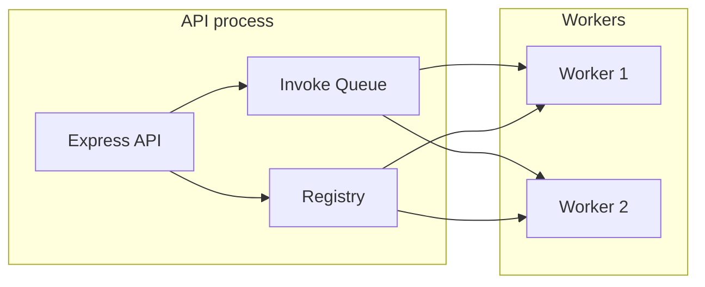

# Architecture in Detail

## Process model

The server runs a **single Node.js process** that:

- Hosts the **Express API** (all HTTP routes).
- Holds an **in-memory registry** of deployments (suffix → `Application`).
- Maintains an **invoke queue** that maps invocation IDs to resolve/reject callbacks.
- Spawns **one child process (worker) per deployment**, each run via `metacall worker/index.js` with IPC (`process.send` / `process.on('message')`).



## Core types

- **`Resource`** — Identifies a deployment: `id` (suffix), `path` (filesystem path to app), `jsons`, `runners`, optional `type`/`blob`.
- **`Application`** — Stored per suffix: `resource` (Promise of `Resource`), `proc` (child process), `deployment` (metadata from worker after load). Has `kill()` to stop the worker.
- **Registry** — Interface: `get(id)`, `set(id, application)`, `delete(id)`, `values()`. Implementation: `InMemoryApplicationRegistry` (Map).
- **Invoke queue** — `push({ resolve, reject })` returns an invocation `id`; `get(id)` removes and returns the invocation. Used to match `InvokeResult` messages from workers to the correct HTTP response.

## Directory structure (source)

```
src/
├── index.ts              # Entry: calls bootstrap run()
├── bootstrap.ts          # Config, ensure apps dir, prune, registry, queue, autoDeployApps, initializeAPI, listen
├── api.ts                # Express app: routes, app.locals.registry, app.locals.invokeQueue, global error handler
├── app.ts                # Resource, Application
├── config/               # getConfig(): port, appsDirectory, prefix, apiVersion; overrides for tests
├── controller/           # call, deploy, delete, inspect, logs, package, repository, static, validate, error, catch
├── services/             # call (invoke), deployment (create/delete), inspect, package (uploadAndRegister), repository
├── registry/             # ApplicationRegistry interface, InMemoryApplicationRegistry
├── worker/               # protocol (message types), index.js entry (load + invoke handlers, MetaCall APIs)
├── helpers/              # env, fs, repository, upload
├── utils/                # appError, autoDeploy, config (configDir), deploy (deployProcess), exec, invoke (InvokeQueue), logger, install, etc.
└── types/                # API types, errors
```

## Bootstrap sequence

1. Parse argv: `--version` → print version and exit; `--prune` → remember for later.
2. `dotenv.config()`, `colors.enable()`.
3. `getConfig()` → port, appsDirectory, prefix, apiVersion.
4. `ensureFolderExists(appsDirectory)`.
5. If `--prune`: `pruneDirectory(appsDirectory)`.
6. Create `InMemoryApplicationRegistry` and `InvokeQueue`.
7. **Auto-deploy**: `autoDeployApps(appsDirectory, registry, invokeQueue)` — for each subdirectory of apps dir, create a `Resource`, set an `Application` in the registry, then `deployProcess(resource, env, registry, invokeQueue)` (same as deploy API: spawn worker, send Load, wait for MetaData).
8. `initializeAPI({ registry, invokeQueue })` → Express app with routes and `app.locals`; `app.listen(config.port)`.

## Layers

| Layer | Responsibility |
|-------|----------------|
| **API** | Express setup, route registration, `app.locals`, 404 fallback, global error handler. |
| **Controllers** | Parse request, call services, send response; use `catchAsync` where needed. |
| **Services** | Business logic: invoke (registry + queue + worker send), create/delete deployment, upload and register package, repository operations, inspect. |
| **Registry** | In-memory map of suffix → Application. |
| **Worker** | Child process: receives Load (Resource), loads via MetaCall, sends MetaData; receives Invoke, calls function, sends InvokeResult. |
| **Utils / Helpers** | deployProcess (spawn, send Load, handle message), InvokeQueue, install deps, config dir, logging, etc. |

## Configuration

- **port** — From `process.env.PORT` or default `9000`.
- **appsDirectory** — From config dir (e.g. `~/.metacall/faas`) + `apps`.
- **prefix** — Used in call/static routes; default `hostname()`.
- **apiVersion** — e.g. `v1` (for future use).

Test overrides: `setConfigForTest(partial)`, `clearConfigOverrides()`.
