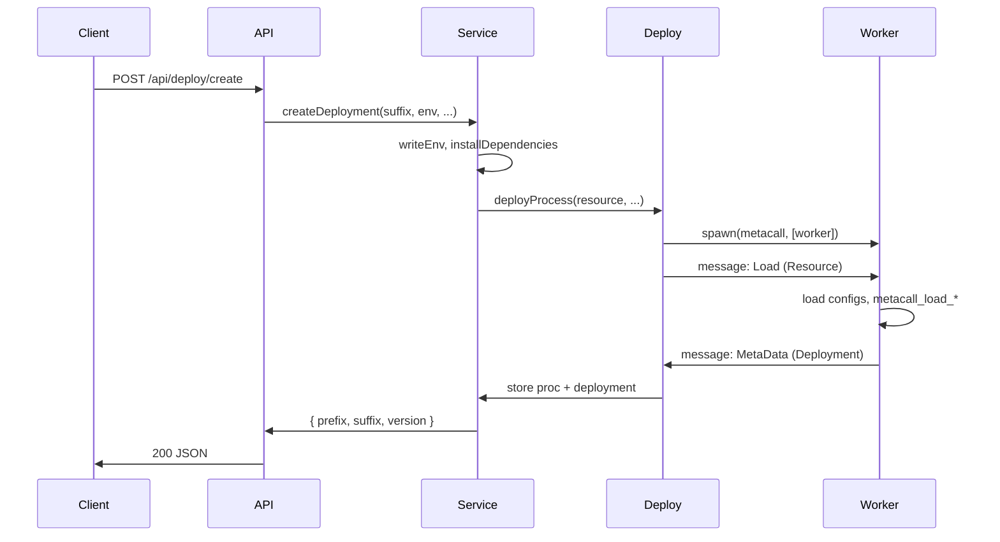
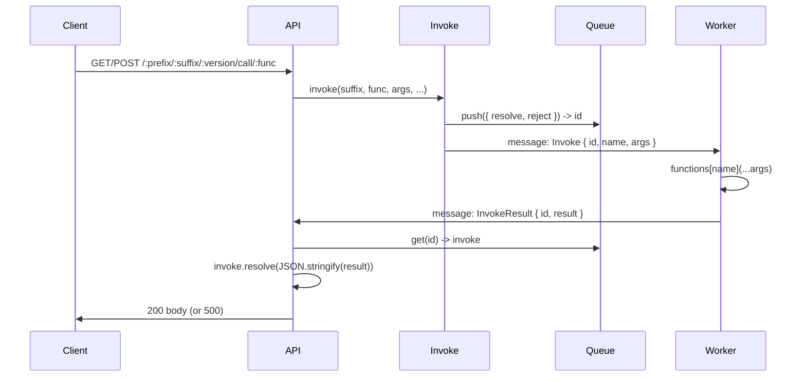

# Data Flow

## Deploy flow

Deployment can happen in two ways: **package upload** or **repository clone**, followed by **deploy create**. The following describes the path from “deploy create” (or auto-deploy) to a running worker.

1. **Register resource** — Package upload or repo clone creates a directory under `appsDirectory` and registers an `Application` in the registry with a `Resource` (id, path, jsons, runners).
2. **Deploy create** — Client calls `POST /api/deploy/create` with `suffix` and optional `env`. Service loads the application from registry, writes `.env` if provided, then:
    - **Install dependencies** — `installDependencies(resource)`: finds runners (nodejs, python, etc.) from dependency files (`package.json`, `requirements.txt`, …) and runs e.g. `metacall npm i`, `metacall pip3 install -r requirements.txt` in the app path.
    - **Deploy process** — `deployProcess(resource, env, registry, invokeQueue)`:
        - Spawns child: `spawn('metacall', [pathToWorkerIndexJs], { stdio: [..., 'ipc'], env })`.
        - Sends **Load** message with `Resource` to the worker.
        - Listens for **message**: on **MetaData**, stores `proc` and `deployment` on the `Application` and resolves the deploy promise; on **InvokeResult**, looks up invocation by id in the queue and resolves the pending HTTP call.
3. **Worker load** — Worker receives **Load**, finds `metacall*.json` files, sets execution paths, calls `metacall_load_from_configuration_export`, builds a `Deployment` object, sends **MetaData** back. Main process then marks the deployment as ready for invocations.

## Call flow

1. Client sends **GET or POST** to `/:prefix/:suffix/:version/call/:func` (optional body = function arguments).
2. **Controller** validates `suffix` and `func`, then calls **invoke** service with `suffix`, `func`, `args`, registry, invokeQueue, and callbacks `onResolve` / `onReject`.
3. **Invoke** looks up `registry.get(suffix)`. If no app or no `proc`, throws (404). Otherwise:
    - Pushes an **Invocation** `{ resolve, reject }` to the queue and gets an `id`.
    - Sends to `application.proc` a message: **Invoke** `{ id, name: func, args }`.
4. **Worker** receives **Invoke**, looks up `functions[name]`, runs it with `args`, sends **InvokeResult** `{ id, result }`.
5. **Main process** (in `deployProcess`’s `proc.on('message')`) receives **InvokeResult**, calls `invokeQueue.get(id)` to get the invocation, then `invoke.resolve(JSON.stringify(result))`.
6. The promise that the controller is waiting on resolves; the controller sends the string (or error) back as the HTTP response.

## Delete flow

-   Client calls `POST /api/deploy/delete` with deployment identifier.
-   Service gets application from registry; if missing or no `proc`, returns 404.
-   Calls `application.kill()` (kills worker process), `registry.delete(suffix)`, then removes the app directory from disk (`rm(appsDirectory/suffix)`).
